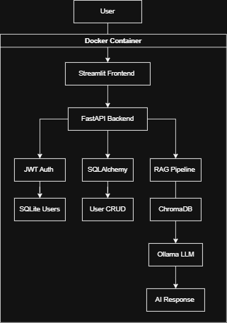
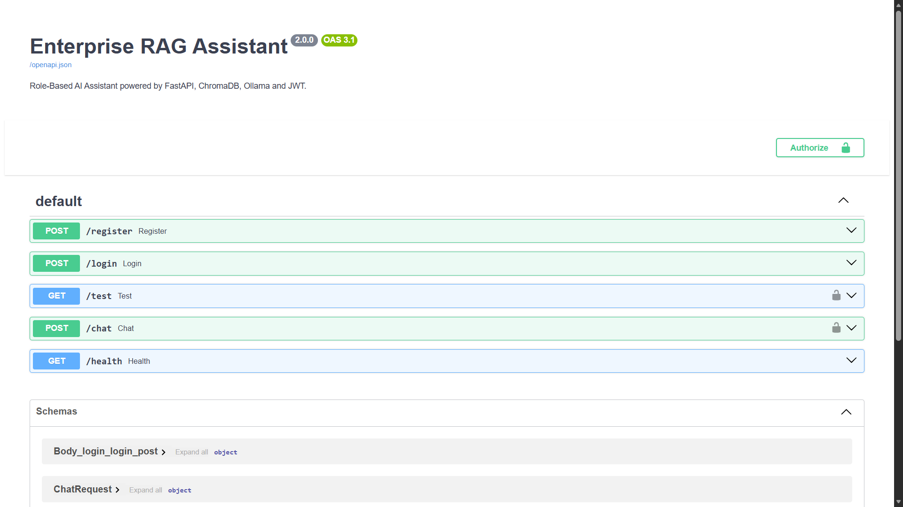
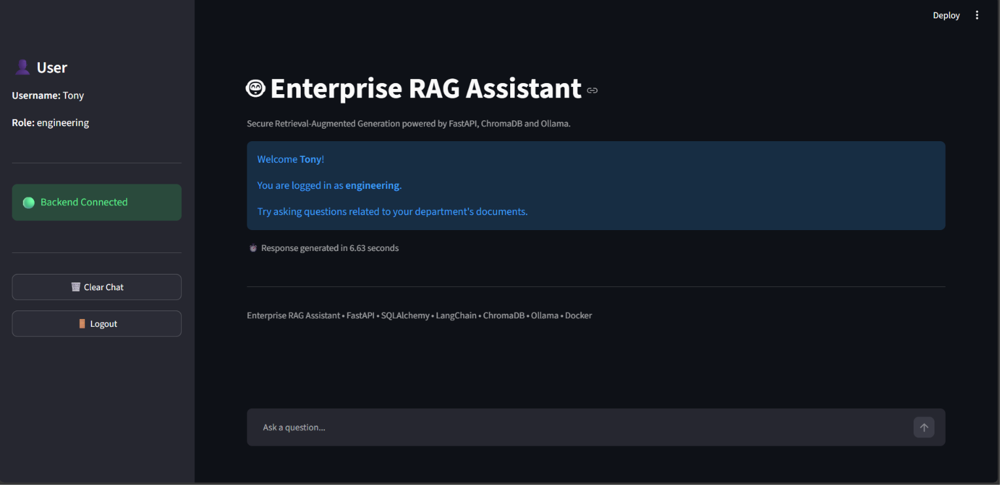

# Enterprise RAG Assistant
**Project Overview**
An enterprise-grade Retrieval-Augmented Generation (RAG) assistant built using FastAPI, LangChain, ChromaDB, Ollama, and SQLAlchemy.

The application enables secure, role-based document retrieval using JWT authentication and Retrieval-Augmented Generation (RAG). Users receive responses generated from department-specific knowledge bases while Role-Based Access Control (RBAC) ensures they can only access authorized documents.

The project follows a modular backend architecture with REST APIs, SQLite for user management, ChromaDB for vector storage, Docker support, and automated API testing using Pytest.

**Features**
- JWT-based Authentication and Authorization
- Role-Based Access Control (RBAC)
- Retrieval-Augmented Generation (RAG)
- Department-specific document retrieval
- Semantic search using ChromaDB
- Ollama-powered local LLM inference
- SQLite database with SQLAlchemy ORM
- RESTful APIs built with FastAPI
- Dockerized application
- Automated API testing using Pytest
- Modular and scalable backend architecture

**System Architecture**
<p align="center">
  
</p>
The application follows a modular backend architecture where authenticated users submit queries through a REST API. The system retrieves relevant document chunks using ChromaDB, augments the prompt with contextual information, generates responses using Ollama, and returns role-restricted answers based on JWT-authenticated user permissions.

Tech Stack
| Category | Technologies |
|----------|--------------|
| Backend | FastAPI |
| Language | Python |
| Database | SQLite |
| ORM | SQLAlchemy |
| Authentication | JWT, OAuth2 |
| Vector Database | ChromaDB |
| LLM | Ollama |
| RAG Framework | LangChain |
| Embeddings | Sentence Transformers |
| Testing | Pytest |
| Containerization | Docker, Docker Compose |

**Project Structure**
```text
enterprise-rag-assistant/
│
├── app/
│   ├── api/            # Authentication & Chat endpoints
│   ├── core/           # Config, Database & Security
│   ├── crud/           # Database CRUD operations
│   ├── models/         # SQLAlchemy models
│   ├── rag/            # Retrieval, Prompt & LLM Pipeline
│   └── schemas/        # Request & Response models
│
├── frontend/           # Streamlit UI
├── resources/          # Knowledge base documents
├── tests/              # Automated API tests
├── assets/             # Images used in README
├── Dockerfile
├── docker-compose.yml
├── requirements.txt
└── README.md
```

**Getting Started**
    **Prerequisites**
    - Python 3.11+
     - Ollama
     - Git
     - Docker (Optional)
    **Installation**
    Clone the repository

     ```bash
     git clone <repository-url>
     cd enterprise-rag-assistant
     ```

     Create a virtual environment

     ```bash
     python -m venv .venv
     ```

     Activate it

     Windows

     ```bash
     .venv\Scripts\activate
     ```

     Linux / macOS

     ```bash
     source .venv/bin/activate
     ```

     Install dependencies

     ```bash
     pip install -r requirements.txt
     ```

     Configure environment variables

     ```bash
     cp .env.example .env
     ```

     Start Ollama

     ```bash
     ollama serve
     ```

     Pull the required model

     ```bash
     ollama pull llama3.2
     ```

     Run FastAPI

     ```bash
     uvicorn app.main:app --reload
     ```

     Swagger

     ```
     http://localhost:8000/docs
     ```
   **Docker Setup**
     Build the Docker image

     ```bash
     docker build -t enterprise-rag .
     ```

     Run the container

     ```bash
     docker run -p 8000:8000 --env-file .env enterprise-rag
     ```

     Or using Docker Compose

     ```bash
     docker compose up --build
     ```

API Endpoints
| Method | Endpoint | Description |
|---------|----------|-------------|
| POST | `/register` | Register a new user |
| POST | `/login` | Authenticate user and return JWT |
| POST | `/chat` | Query the RAG assistant |
| GET | `/test` | Verify JWT authentication |

**Authentication Flow**
1. User registers using `/register`
2. User logs in using `/login`
3. FastAPI validates credentials
4. A JWT Access Token is generated
5. Client sends the token in the `Authorization` header
6. Protected endpoints verify the token before processing requests

**How RAG Works**
1. User submits a natural language query.
2. JWT authentication verifies the user's identity.
3. RBAC filters documents based on the user's department.
4. ChromaDB performs semantic similarity search.
5. The most relevant document chunks are retrieved.
6. Retrieved context is combined with the user's question.
7. Ollama generates a context-aware response.
8. FastAPI returns the final answer to the client.

**Testing**
Automated API tests are written using **Pytest** and **FastAPI TestClient**.

Current test coverage includes:

- User Registration
- Login Authentication
- JWT Validation
- Protected Endpoints
- Chat API

**Future Improvements**
- PostgreSQL support
- Redis caching
- Conversation history
- Streaming LLM responses
- Admin dashboard
- CI/CD with GitHub Actions
- Cloud deployment

**Screenshots**
### Swagger UI

<p align="center">

</p>

---

### Chat Interface

<p align="center">

</p>

**Note:** This project currently runs locally using Ollama for privacy and offline inference. A cloud deployment can be achieved by replacing the local LLM with a hosted inference provider such as OpenAI or Groq.

**Key Learning Outcomes**
This project helped me gain practical experience with:

- FastAPI backend development
- REST API design
- JWT Authentication & Authorization
- Role-Based Access Control (RBAC)
- SQLAlchemy ORM
- SQLite database management
- Retrieval-Augmented Generation (RAG)
- ChromaDB vector database
- Ollama local LLM integration
- Docker containerization
- Automated API testing using Pytest

**Author:**
**Poornesh**

Integrated M.Tech Software Engineering  
VIT Vellore

Feel free to connect or contribute to the project.
