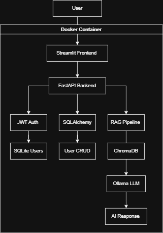
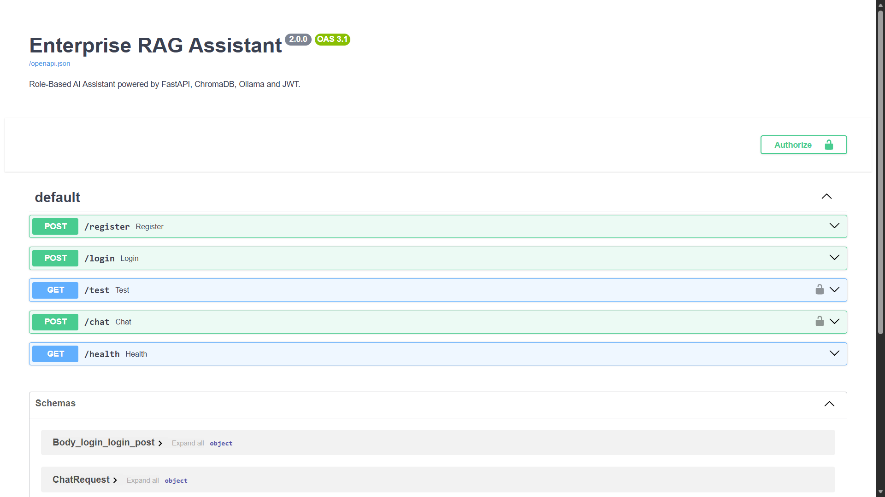
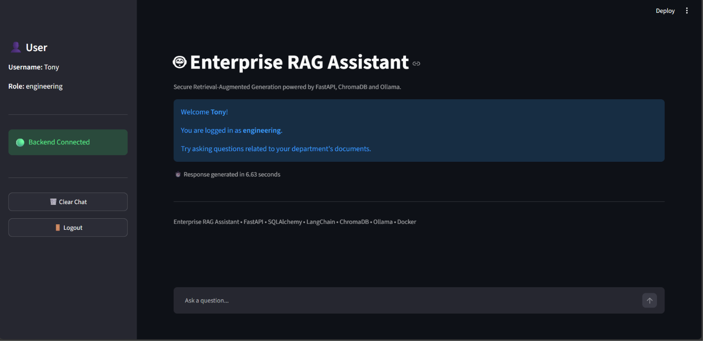

# Enterprise RAG Assistant
> Secure, role-based Retrieval-Augmented Generation (RAG) assistant built with FastAPI, ChromaDB, LangChain, and Groq.
> 


**Table of Contents**

- Project Overview
- Features
- System Architecture
- Tech Stack
- Project Structure
- Getting Started
- API Endpoints
- Authentication Flow
- RAG Workflow
- Testing
- Future Improvements
- Screenshots
- Learning Outcomes

**Project Overview**

An enterprise-grade Retrieval-Augmented Generation (RAG) assistant built using FastAPI, LangChain, ChromaDB, Groq, SQLAlchemy, and Streamlit.  

The application enables secure, role-based document retrieval using JWT authentication and Retrieval-Augmented Generation (RAG). Users receive responses generated from department-specific knowledge bases while Role-Based Access Control (RBAC) ensures they can only access authorized documents.

The project follows a modular backend architecture with REST APIs, SQLite for user management, ChromaDB for vector storage, Docker support, and automated API testing using Pytest.

**Features**

- JWT Authentication & Authorization
- Role-Based Access Control (RBAC)
- Retrieval-Augmented Generation (RAG)
- Semantic Search using ChromaDB
- Groq LLM Integration
- LangChain Prompt Pipeline
- SQLite with SQLAlchemy ORM
- Streamlit Chat Interface
- Dockerized Deployment
- Automated API Testing using Pytest

**System Architecture**
<p align="center">
  
</p>
The application follows a modular client-server architecture where Streamlit communicates with FastAPI through REST APIs. The backend authenticates users using JWT, retrieves relevant document chunks from ChromaDB, constructs a Retrieval-Augmented Generation (RAG) prompt, and sends it to the Groq LLM for response generation.

**Tech Stack**

| Category | Technologies |
|----------|--------------|
| Backend | FastAPI |
| Language | Python |
| Database | SQLite |
| ORM | SQLAlchemy |
| Authentication | JWT, OAuth2 |
| Vector Database | ChromaDB |
| LLM | Groq API |
| RAG Framework | LangChain |
| Embeddings | Sentence Transformers |
| Testing | Pytest |
| Containerization | Docker, Docker Compose |

**Project Structure**

```text
enterprise-rag-assistant/
│
├── app/
│   ├── api/            # Authentication & Chat endpoints
│   ├── core/           # Config, Database & Security
│   ├── crud/           # Database CRUD operations
│   ├── models/         # SQLAlchemy models
│   ├── rag/            # Retrieval, Prompt & LLM Pipeline
│   └── schemas/        # Request & Response models
│
├── frontend/           # Streamlit UI
├── resources/          # Knowledge base documents
├── tests/              # Automated API tests
├── assets/             # Images used in README
├── Dockerfile
├── docker-compose.yml
├── requirements.txt
└── README.md
```

**Getting Started**
Prerequisites

Make sure the following are installed:

Python 3.11+
Git
Docker (optional)

You will also need:

A Groq API Key
A Hugging Face Access Token
1. Clone the Repository
git clone https://github.com/your-username/enterprise-rag-assistant.git

cd enterprise-rag-assistant
2. Create a Virtual Environment
Windows
python -m venv .venv

.venv\Scripts\activate
Linux / macOS
python3 -m venv .venv

source .venv/bin/activate
3. Install Dependencies
pip install -r requirements.txt
4. Configure Environment Variables

Create a .env file in the project root:

GROQ_API_KEY=gsk_your_groq_api_key_here
GROQ_MODEL=openai/gpt-oss-20b

HUGGINGFACEHUB_API_TOKEN=hf_your_huggingface_token_here

JWT_SECRET=your_super_secret_jwt_key
ALGORITHM=HS256
ACCESS_TOKEN_EXPIRE_MINUTES=30

Important: Never commit your .env file or API keys to GitHub.

5. Run the Application
Start the FastAPI Backend
uvicorn app.main:app --reload --port 8000

The API will be available at:

http://127.0.0.1:8000
Start the Streamlit Frontend

Open another terminal:

streamlit run frontend/app.py

**API Documentation**

FastAPI automatically provides interactive Swagger documentation.

Open:

http://127.0.0.1:8000/docs

You can use Swagger UI to:

Register users
Authenticate users
Obtain JWT tokens
Test protected endpoints
Send RAG queries

**Docker Setup**

The backend can also be run using Docker Compose.

docker compose up --build

This builds the application container and starts the configured services.

**Deployment**
Backend — Render

The FastAPI backend can be deployed as a Render Web Service.

Configuration

Runtime

Python 3

Build Command

pip install -r requirements.txt

Start Command

uvicorn app.main:app --host 0.0.0.0 --port $PORT
Environment Variables

Configure the following variables in Render:

GROQ_API_KEY
GROQ_MODEL
HUGGINGFACEHUB_API_TOKEN
JWT_SECRET
Frontend — Streamlit Cloud

Deploy the frontend application using Streamlit Cloud.

Configure the backend URL through Streamlit Secrets:

BACKEND_URL = "https://your-fastapi-backend.onrender.com"

The Streamlit frontend then communicates with the deployed FastAPI backend through REST APIs.

**API Endpoints**

| Method | Endpoint | Description |
|---------|----------|-------------|
| POST | `/register` | Register a new user |
| POST | `/login` | Authenticate user and return JWT |
| POST | `/chat` | Query the RAG assistant |
| GET | `/test` | Verify JWT authentication |

**RAG & Security Workflow**

The complete request flow is:

┌──────────────────┐
│  User Question   │
└────────┬─────────┘
         │
         ▼
┌──────────────────┐
│   JWT Auth Check │
└────────┬─────────┘
         │
         ▼
┌──────────────────┐
│ Extract User Role│
│      (RBAC)      │
└────────┬─────────┘
         │
         ▼
┌──────────────────┐
│ ChromaDB         │
│ Similarity Search│
│ Role Restricted  │
└────────┬─────────┘
         │
         ▼
┌──────────────────┐
│ Retrieved Context│
└────────┬─────────┘
         │
         ▼
┌──────────────────┐
│ Augmented Prompt │
└────────┬─────────┘
         │
         ▼
┌──────────────────┐
│    Groq LLM      │
└────────┬─────────┘
         │
         ▼
┌──────────────────┐
│ Generated Answer │
└──────────────────┘
Security Flow
User
  │
  ▼
Login
  │
  ▼
JWT Token
  │
  ▼
Authenticated Request
  │
  ▼
Extract Role
  │
  ├── Engineering ──► Engineering Documents
  │
  ├── HR ───────────► HR Documents
  │
  └── Management ──► Management Documents

This ensures that document retrieval is constrained by the authenticated user's role.

**Testing**

Automated API tests are written using **Pytest** and **FastAPI TestClient**.

Current test coverage includes:

- User Registration
- Login Authentication
- JWT Validation
- Protected Endpoints
- Chat API

**Future Improvements**
- PostgreSQL migration
- Redis caching
- Streaming responses
- Conversation history
- Source citations
- Kubernetes deployment
- CI/CD using GitHub Actions

**Screenshots**

### Swagger UI

<p align="center">

</p>

---

### Chat Interface

<p align="center">

</p>

**Key Learning Outcomes**

This project helped me gain practical experience with:

- FastAPI backend development
- REST API design
- JWT Authentication & Authorization
- SQLAlchemy ORM
- Dependency Injection
- Retrieval-Augmented Generation (RAG)
- ChromaDB vector database
- LangChain
- Groq API integration
- Docker containerization
- Automated API testing

**Author:**
**Poornesh**

Integrated M.Tech Software Engineering  
VIT Vellore

Feel free to connect or contribute to the project.
